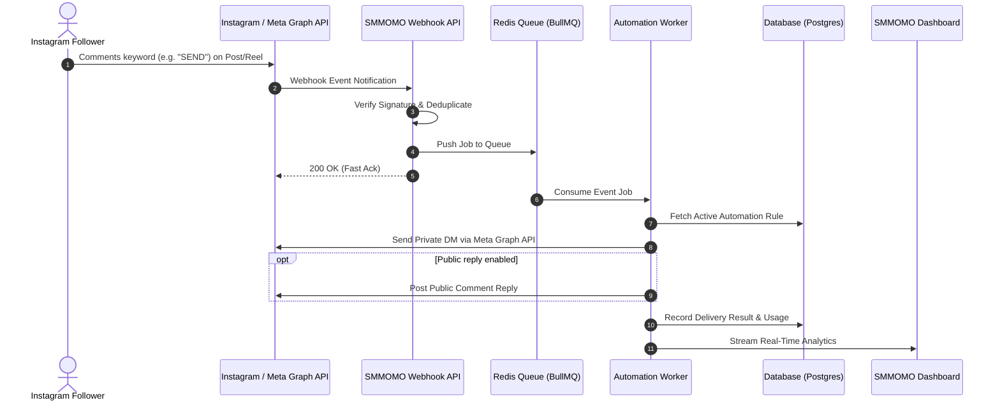

<div align="center">


# SMMOMO

### Turn Instagram Comments into Instant Conversions with Automated DMs

[](TASK.md)
[](https://nextjs.org/)
[](https://react.dev/)
[](https://www.typescriptlang.org/)
[](https://tailwindcss.com/)
[](#)

[Overview](#-overview) •
[Key Features](#-key-features) •
[Architecture](#-architecture) •
[Tech Stack](#-technology-stack) •
[Getting Started](#-getting-started) •
[Repository Layout](#-repository-layout)

---

</div>

## 📌 Overview

**SMMOMO** is a modern social media automation platform. **V1 Focus: Instagram Comment → Automated Private DM.**

Creators and businesses connect their Instagram account, pick a post or reel, configure an automation with trigger keywords, and define a personalized private direct message (plus an optional public reply). When followers comment with the keyword, SMMOMO captures the event, matches the automation rule, dispatches the private DM, and records real-time analytics on the dashboard.

> **Owner:** Bishal Aryal  
> **Current Phase:** Frontend foundation with centralized mock API layer.

---

## ✨ Key Features

<table>
  <tr>
    <td width="50%">
      <h3>🎯 Keyword-Triggered DMs</h3>
      <p>Automatically send links, PDFs, discount codes, or onboarding flows directly to direct messages when users comment targeted keywords.</p>
    </td>
    <td width="50%">
      <h3>💬 Public Auto-Replies</h3>
      <p>Optionally publish instant public replies to comments, boosting engagement signals and confirming delivery to followers.</p>
    </td>
  </tr>
  <tr>
    <td width="50%">
      <h3>⚡ Resilient Queueing</h3>
      <p>Decoupled webhook processing with Redis and BullMQ ensures zero dropped events even during viral traffic spikes.</p>
    </td>
    <td width="50%">
      <h3>📊 Real-Time Analytics</h3>
      <p>Monitor delivery status, conversion metrics, response times, and automation performance directly on the dashboard.</p>
    </td>
  </tr>
  <tr>
    <td width="50%">
      <h3>🛡️ Rate Limiting & Safety</h3>
      <p>Engineered strictly around official Meta API guidelines to preserve account health, rate limits, and compliance.</p>
    </td>
    <td width="50%">
      <h3>🔒 Multi-Tenant Security</h3>
      <p>Complete workspace and token isolation ensuring zero cross-tenant data exposure.</p>
    </td>
  </tr>
</table>

---

## 🏛️ Architecture

### Event Lifecycle



### Key Principles

- **Frontend-first:** The UI communicates with structured API modules in `apps/web/lib/api/`, never raw scattered `fetch` calls. During the current foundation phase, these modules deliver realistic mock data from `apps/web/lib/mock/`.
- **Fast Webhooks:** Receive → verify signature → deduplicate → acknowledge `200 OK` → enqueue. Heavy tasks never block webhook responses.
- **Idempotency:** Webhook IDs are tracked to ensure duplicate delivery from Meta never results in duplicate user DMs.
- **Official Docs Compliance:** Meta Graph API behavior is verified against current official documentation before implementation.

---

## 🛠️ Technology Stack

| Layer | Technology | Details |
|---|---|---|
| **Frontend** | [Next.js 15 (App Router)](https://nextjs.org/), [React 19](https://react.dev/) | Modern SSR/CSR hybrid application |
| **Language** | [TypeScript 5](https://www.typescriptlang.org/) | Strict typing across workspaces |
| **Styling** | [Tailwind CSS 3.4](https://tailwindcss.com/) | Responsive dark/light theme ready UI |
| **Backend (Planned)** | [Node.js](https://nodejs.org/) & [Fastify](https://fastify.dev/) | Ultra-low latency API service |
| **Database (Planned)** | [PostgreSQL](https://www.postgresql.org/) & [Prisma](https://www.prisma.io/) | Type-safe persistence and migrations |
| **Queue (Planned)** | [Redis](https://redis.io/) & [BullMQ](https://bullmq.io/) | Distributed job processing |
| **Containers (Planned)** | [Docker](https://www.docker.com/) & Docker Compose | Consistent local and production environments |
| **Social API** | [Meta Graph API](https://developers.facebook.com/) | Official Instagram Messaging & Webhooks |

---

## 📂 Repository Layout

```text
smmomo/
├── apps/
│   └── web/              # Next.js frontend application
│       ├── app/          # App router pages (dashboard, automations, inbox, settings)
│       ├── components/   # UI components and layout shells
│       └── lib/          # API layer and mock datasets
├── packages/             # Shared libraries and types (reserved)
├── docs/                 # Architecture records and assets
│   └── assets/           # Visual diagrams, mockups, and banners
├── tests/                # End-to-end and integration tests
├── docker/               # Docker configurations
├── .env.example          # Environment variable template
├── README.md             # Project overview & quickstart
├── TASK.md               # Active task tracker and AI handoff state
└── Tree.md               # Detailed directory tree map
```

---

## 🚀 Getting Started

### Prerequisites

- [Node.js](https://nodejs.org/) (>= 20.0.0)
- [npm](https://www.npmjs.com/) (>= 10.0.0)

### Installation

```bash
# Clone the repository
git clone https://github.com/arybishal/SMMOMO.git

# Enter project directory
cd SMMOMO

# Install dependencies
npm install
```

### Running Locally

```bash
npm run dev
```

Visit [http://localhost:3000](http://localhost:3000) in your browser to view the application.

### Available Scripts

| Command | Description |
|---|---|
| `npm run dev` | Starts the Next.js development server |
| `npm run build` | Compiles the production build |
| `npm run lint` | Runs ESLint validation |
| `npm run typecheck` | Checks types with `tsc --noEmit` |

---

## ⚙️ Environment Variables

Copy `.env.example` to `.env` and configure variables as features roll out:

```bash
cp .env.example .env
```

| Variable | Status | Purpose |
|---|---|---|
| `NEXT_PUBLIC_API_URL` | Reserved | Base URL of the Fastify API (default: `http://localhost:4000`) |
| `DATABASE_URL` | Reserved | PostgreSQL connection URI |
| `REDIS_URL` | Reserved | Redis connection URI for queueing |
| `META_APP_ID` | Reserved | Meta Developer App ID |
| `META_APP_SECRET` | Reserved | Meta Developer App Secret |
| `META_WEBHOOK_VERIFY_TOKEN` | Reserved | Webhook verification handshake secret |

> [!IMPORTANT]
> Secrets are strictly ignored by `.gitignore`. Real credentials must never be committed.

---

## 🎨 Design System

Tokens live in `apps/web/app/globals.css` under a single Tailwind v4 `@theme` block. UI code uses these semantic classes — not raw palette values.

### Colors

| Token | Purpose |
|---|---|
| `background` / `surface` / `surface-muted` | Page / card / muted panel backgrounds |
| `foreground` / `muted-foreground` / `subtle-foreground` | Primary / secondary / tertiary text |
| `border` / `border-muted` | Default / subtle borders and dividers |
| `primary` / `primary-hover` / `primary-strong` / `primary-soft` / `primary-foreground` | Brand accent (indigo) |
| `success` / `warning` / `danger` / `info` + `-soft` / `-strong` / `-foreground` | Status families; `info` aliases `primary` |
| `neutral-soft` / `neutral-strong` | Subtle neutral chips / emphasis greys |

All values are Tailwind v4 oklch defaults, copied 1:1 from `tailwindcss/theme.css` — the tokens preserve the existing palette, they do not change it.

### Radius & shadow

| Token | Replaces | Used for |
|---|---|---|
| `rounded-control` | `rounded-md` | Buttons, inputs, chips |
| `rounded-card` | `rounded-lg` | Cards, panels, menus |
| `rounded-pill` | `rounded-full` | Badges, avatars |
| `shadow-card` | `shadow-sm` | Card elevation |

### Typography & spacing

- Fonts: Geist Sans (body) / Geist Mono (code) — `--font-sans` / `--font-mono`.
- Hierarchy: page titles `text-xl`, section titles `text-lg`, card titles `text-sm font-semibold`, body `text-sm`, meta `text-xs`, metric values `text-2xl`/`text-3xl font-semibold tabular-nums`.
- Spacing: standard Tailwind scale (`p-4`, `gap-4`, `space-y-6`) — no custom spacing tokens.

### Status badges

Tone-based: `success`, `paused`, `draft`, `failed`, `neutral`, `info`. Rings use the opacity modifier (`ring-success/20`) rather than dedicated ring tokens.

### Rules for new UI

- Brand, status, surface, and text colors must use tokens — not raw `indigo-*`/`red-*`/`zinc-900` etc.
- Deliberate exceptions (keep as-is): intermediate greys (`text-zinc-600`, `text-zinc-700`), code/keyword chips (`bg-zinc-100`), input focus ring (`ring-zinc-300`), chart colors (`bg-indigo-500`/`bg-indigo-200`), gradient placeholders, sidebar scrim (`bg-zinc-950/40`).
- **Dark mode is deferred** — do not add `dark:` variants. It ships as a coordinated follow-up with its own token pass, not piecemeal.

---

## 📈 Project Status & Roadmap

| Milestone | Status | Description |
|---|---|---|
| **Phase 1: Frontend Foundation** | 🟡 In Progress | Dashboard UI, automations management, mock data layer (Tasks 001–003 done) |
| **Phase 2: Backend & Database** | ⚪ Not Started | Fastify server, PostgreSQL schema, BullMQ queue |
| **Phase 3: Meta API Integration** | ⚪ Not Started | Webhook verification, OAuth, Graph API DM dispatch |
| **Phase 4: Production Readiness** | ⚪ Not Started | Docker orchestration, monitoring, analytics |

For real-time progress and the current sprint backlog, consult **[`TASK.md`](TASK.md)**.
