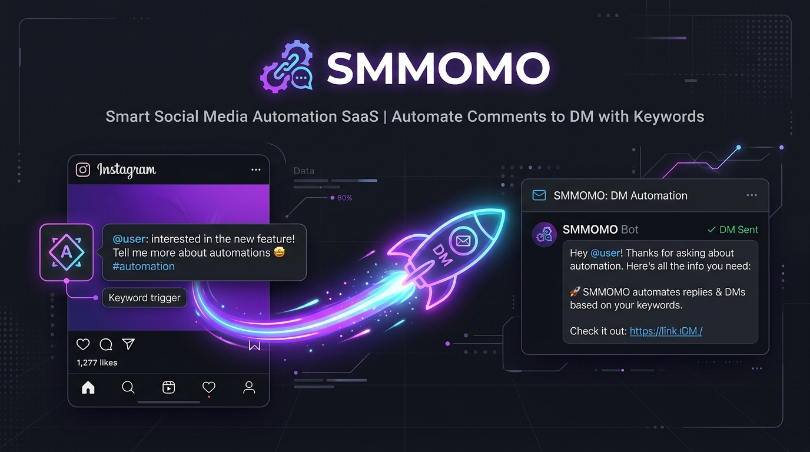
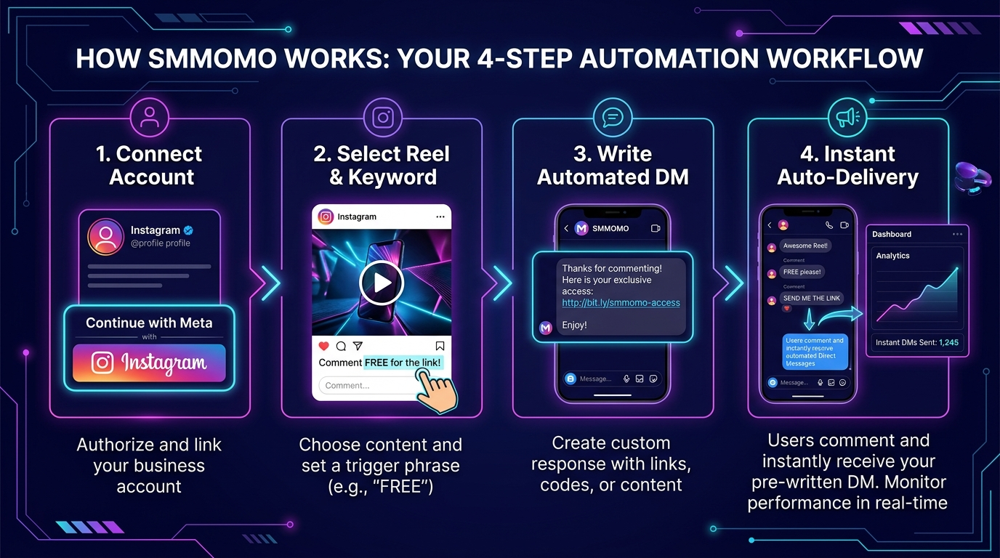
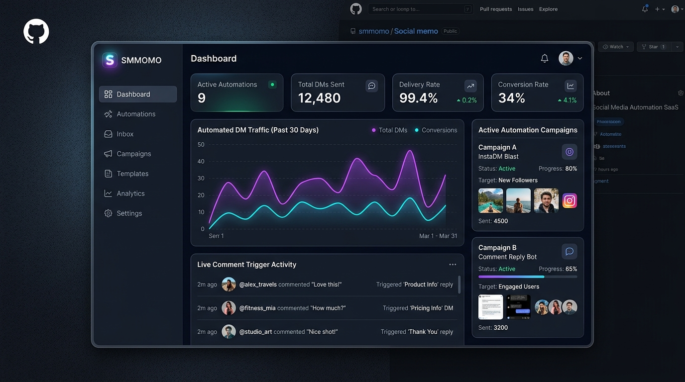
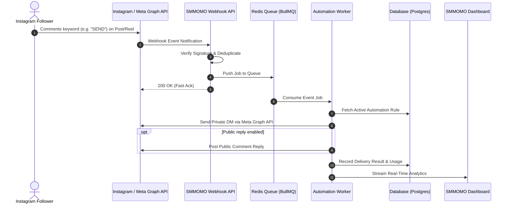

<div align="center">



# SMMOMO — Instagram Comment-to-DM Automation Platform

### Turn Instagram Comments into Instant Conversions with Automated Direct Messages

[](TASK.md)
[](https://nextjs.org/)
[](https://react.dev/)
[](https://www.typescriptlang.org/)
[](https://tailwindcss.com/)
[](#)

[Overview](#-overview--what-is-smmomo) •
[How It Works](#-how-it-works--4-step-automation-workflow) •
[Key Features](#-key-features--capabilities) •
[Dashboard UI](#-modern-dashboard-interface) •
[Architecture](#-system-architecture--how-smmomo-works) •
[Tech Stack](#-technology-stack--core-frameworks) •
[Getting Started](#-getting-started--local-development)

---

</div>

## 📌 Overview — What is SMMOMO?

**SMMOMO** is an open-source **Instagram comment-to-DM automation SaaS** designed to convert social media engagement into qualified leads, community growth, and automated sales. SMMOMO streamlines the entire **Instagram Comment → Automated Private DM** lifecycle using keyword triggers, instant webhook processing, and official Meta Graph API integrations.

When followers comment on an Instagram Post or Reel with a specified trigger keyword (such as `"LINK"`, `"TEMPLATE"`, or `"DISCOUNT"`), SMMOMO detects the webhook event in real time, matches the automation rule, dispatches a personalized private message directly to their inbox, and optionally posts an instant public comment reply.

### 🎯 Who is SMMOMO for?
- **Content Creators & Influencers:** Deliver free resources, course links, and digital downloads without manually checking DMs.
- **E-Commerce & Brands:** Convert viral Reels and product drops directly into website visits and checkout links.
- **Social Media Managers & Agencies:** Manage scalable, automated outreach campaigns with real-time conversion and delivery metrics.

> **Owner:** Bishal Aryal  
> **Current Phase:** Frontend foundation complete (Tasks 001–010); backend scaffolded (`apps/api`).

---

## 🔄 How It Works — 4-Step Automation Workflow

<div align="center">
  
</div>

| Step | Action | Description |
|:---:|---|---|
| **01** | **Connect Account** | Authorize and link your Instagram Professional account securely through Meta OAuth with zero credential leakage. |
| **02** | **Select Reel & Keyword** | Choose any Instagram post or reel and configure your trigger keywords or hashtags (e.g., `FREE`, `LINK`, `PROMO`). |
| **03** | **Write Automated DM** | Craft personalized direct messages containing download links, guides, or coupons, plus an optional public comment reply. |
| **04** | **Instant Auto-Delivery** | Followers comment, the event triggers in real time, the DM is delivered in seconds, and performance metrics populate your dashboard. |

---

## ✨ Key Features & Capabilities

<table>
  <tr>
    <td width="50%">
      <h3>🎯 Keyword-Triggered DMs</h3>
      <p>Automatically send links, PDFs, discount codes, or onboarding flows directly to direct messages when users comment targeted keywords.</p>
    </td>
    <td width="50%">
      <h3>💬 Public Auto-Replies</h3>
      <p>Optionally publish instant public replies to comments, boosting engagement signals and confirming delivery to followers.</p>
    </td>
  </tr>
  <tr>
    <td width="50%">
      <h3>⚡ Resilient Queueing</h3>
      <p>Decoupled webhook processing with Redis and BullMQ ensures zero dropped events even during viral traffic spikes.</p>
    </td>
    <td width="50%">
      <h3>📊 Real-Time Analytics</h3>
      <p>Monitor delivery status, conversion metrics, response times, and automation performance directly on the dashboard.</p>
    </td>
  </tr>
  <tr>
    <td width="50%">
      <h3>🛡️ Rate Limiting & Safety</h3>
      <p>Engineered strictly around official Meta API guidelines to preserve account health, rate limits, and compliance.</p>
    </td>
    <td width="50%">
      <h3>🔒 Multi-Tenant Security</h3>
      <p>Complete workspace and token isolation ensuring zero cross-tenant data exposure.</p>
    </td>
  </tr>
</table>

---

## 🖥️ Modern Dashboard Interface

<div align="center">
  
</div>

**Dashboard** — the "is it working / what's happening / what next" command center: profile + timezone greeting, connection status with reconnect guidance, onboarding setup card, Today's activity and Automation health, a Needs Attention section that only surfaces real problems (connection errors, failed deliveries), a recent-activity feed, and contextual quick actions.

**Interactive demo** — a 4-step walkthrough on the Dashboard (`dashboard/demo.tsx`) with a "Try the demo" animation. It is a pure client island: no data-layer imports, so it cannot create comments/deliveries, increment usage, affect analytics or automation statistics, or call Meta APIs.

**Analytics** — the "what happened" page (`/analytics`): URL-driven filters (date-range presets, custom range ≤ 366 days, automation, post), KPIs with honest period-over-period deltas (shown only when the previous period is non-zero), an activity chart that auto-aggregates weekly beyond 31 buckets, a received → matched → DM funnel, automation and content performance tables, delivery health (`Attempted = sent + delivered + failed`; Graph "sent" = *accepted by Instagram*), failure records, and plain-language insights. Invalid ranges render an honest notice with a reset link — never fabricated numbers.

**Automation simulator** — the automation builder includes a local comment simulator that mirrors the engine's keyword rule exactly (non-empty keyword, case-insensitive contains, comment's own post) and explicitly sends nothing.

All of the above is served by `GET /analytics/overview` (`apps/api/src/analytics.ts`), which reads comments/deliveries/posts/automations through the caller's own JWT — workspace RLS is the boundary — with paired range validation, previous-period comparison, and zero database migrations. Known limitations and deferred items are tracked in `TASK.md` under Task 027.

---

## 🏛️ System Architecture — How SMMOMO Works

### Event Lifecycle



### Key Principles

- **Frontend-first:** The UI communicates with structured API modules in `apps/web/lib/api/`, never raw scattered `fetch` calls. During the current foundation phase, these modules deliver realistic mock data from `apps/web/lib/mock/`.
- **Fast Webhooks:** Receive → verify signature → deduplicate → acknowledge `200 OK` → enqueue. Heavy tasks never block webhook responses.
- **Idempotency:** Webhook IDs are tracked to ensure duplicate delivery from Meta never results in duplicate user DMs.
- **Official Docs Compliance:** Meta Graph API behavior is verified against current official documentation before implementation.

---

## 🛠️ Technology Stack & Core Frameworks

| Layer | Technology | Details |
|---|---|---|
| **Frontend** | [Next.js 15 (App Router)](https://nextjs.org/), [React 19](https://react.dev/) | Modern SSR/CSR hybrid application |
| **Language** | [TypeScript 5](https://www.typescriptlang.org/) | Strict typing across workspaces |
| **Styling** | [Tailwind CSS 3.4](https://tailwindcss.com/) | Responsive dark/light theme ready UI |
| **Backend** | [Node.js](https://nodejs.org/) & [Fastify](https://fastify.dev/) | `apps/api`: health + CORS, product routes on end-user JWT/RLS (Task 014), Instagram OAuth (Task 015) |
| **Database** | [Supabase](https://supabase.com/) (PostgreSQL) | Managed Postgres + Auth + RLS; migrations in `supabase/migrations/` |
| **Queue (Planned)** | [Redis](https://redis.io/) & [BullMQ](https://bullmq.io/) | Distributed job processing |
| **Containers (Planned)** | [Docker](https://www.docker.com/) & Docker Compose | Consistent local and production environments |
| **Social API** | [Meta Graph API](https://developers.facebook.com/) | Official Instagram Messaging & Webhooks |

---

## 📂 Repository Layout & Monorepo Structure

```text
smmomo/
├── apps/
│   ├── web/              # Next.js frontend application
│   │   ├── app/          # App router pages (dashboard, automations, posts, inbox, analytics, settings)
│   │   ├── components/   # UI components and layout shells
│   │   └── lib/          # API layer, mock datasets, Supabase clients
│   └── api/              # Fastify backend service (scaffolded: CORS + /health)
│       ├── src/          # server.ts (listen) + app.ts (buildApp)
│       └── package.json  # Workspace "api": dev/build/start/typecheck
├── supabase/             # Supabase config + SQL migrations
├── packages/             # Shared libraries and types (reserved)
├── docs/                 # Architecture records and assets
│   └── assets/           # Visual diagrams, mockups, and banners
├── tests/                # End-to-end and integration tests
├── docker/               # Docker configurations
├── .env.example          # Environment variable template
├── README.md             # Project overview & quickstart
├── TASK.md               # Active task tracker and AI handoff state
└── Tree.md               # Detailed directory tree map
```

---

## 🚀 Getting Started & Local Development

### Prerequisites

- [Node.js](https://nodejs.org/) (>= 20.0.0)
- [npm](https://www.npmjs.com/) (>= 10.0.0)

### Installation

```bash
# Clone the repository
git clone https://github.com/arybishal/SMMOMO.git

# Enter project directory
cd SMMOMO

# Install dependencies
npm install
```

### Running Locally

```bash
npm run dev        # web app → http://localhost:3000
npm run dev:api    # Fastify API → http://localhost:4000 (optional during frontend-only work)
```

Visit [http://localhost:3000](http://localhost:3000) in your browser to view the application.

### Available Scripts

| Command | Description |
|---|---|
| `npm run dev` | Starts the Next.js development server |
| `npm run dev:api` | Starts the Fastify API (watch mode) |
| `npm run build` | Compiles the production build (web) |
| `npm run build:api` | Compiles the API TypeScript to `apps/api/dist` |
| `npm run lint` | Runs ESLint validation (web) |
| `npm run typecheck` | Checks types across the web + api workspaces |

---

## ⚙️ Environment Variables & Configuration

Copy `.env.example` to `.env` and configure variables as features roll out:

```bash
cp .env.example .env
```

| Variable | Status | Purpose |
|---|---|---|
| `NEXT_PUBLIC_API_URL` | Active | Base URL of the Fastify API (default: `http://localhost:4000`) — only web-side API origin seam |
| `NEXT_PUBLIC_COOKIE_DOMAIN` | Optional (prod split-subdomain) | Session cookie `Domain` when API is a different subdomain (e.g. `.example.com`); leave empty on localhost |
| `PORT` | Active | Fastify API listen port (default: `4000`) |
| `CORS_ORIGIN` | Active | Comma-separated **exact** browser origins the API allows (default: `WEB_ORIGIN`); no prefix match, never `*` |
| `WEB_ORIGIN` | Active | Primary frontend origin for OAuth post-redirect (default: `http://localhost:3000`) |
| `API_ORIGIN` | Active | Public API origin for OAuth callback + webhook base (default: `http://localhost:4000`) |
| `NEXT_PUBLIC_SUPABASE_URL` | Active | Supabase project URL (database foundation) |
| `NEXT_PUBLIC_SUPABASE_PUBLISHABLE_KEY` | Active | Supabase publishable key — browser-safe by design; never a `service_role`/`sb_secret_` key in the web app |
| `DATABASE_URL` | Reserved | PostgreSQL connection URI (Supabase provides it if a direct SQL path is needed) |
| `REDIS_URL` | Reserved | Redis connection URI for queueing |
| `META_APP_ID` | Active (API env) | Instagram API with Instagram Login app id (Task 015); empty DB field falls back here |
| `META_APP_SECRET` | Active (API env) | Meta app secret — apps/api only, never the web app; empty DB field falls back here |
| `META_REDIRECT_URI` | Active (API env) | OAuth callback (default `API_ORIGIN/social-accounts/instagram/callback`) — read-only in Settings → Integrations |
| `META_WEBHOOK_VERIFY_TOKEN` | Active (API env) | Webhook verification handshake secret (Task 016); empty DB field falls back here |
| `PLATFORM_ADMIN_EMAILS` | Active (API env) | Comma-separated emails allowed to read/write Settings → Integrations (Task 018A) |
| `PLATFORM_ENCRYPTION_KEY` | Active (API env) | AES-256-GCM key (64 hex or base64) for `platform_settings` secrets **and** `social_accounts.access_token` (v1 envelope, Task 018A + 021) |
| `SUPABASE_SERVICE_ROLE_KEY` | API env only | Service-role key for webhook/engine/delivery/usage/OAuth token writes — never apps/web, never commit |
| — | — | Usage events (Task 019): `usage_events` table is the authority for usage/billing metrics; `automations.*_count` remains analytics authority; no plan limits in V1 (`limit`/`remaining` null) |
| — | — | Security hardening (Task 020): see `docs/security.md` — column-level `social_accounts` reads, timing-safe webhooks, rate limits, security headers, no stack leaks |
| — | — | Production readiness (Task 021): IG tokens encrypted at rest (`v1.` AES-GCM), full CSP, OAuth rate limit, composite FK, member UPDATE revoked on `social_accounts`; see `docs/security.md` |
| — | — | Multi-origin (Task 022): origins centralized in `apps/api/src/origins.ts`; CORS exact allowlist + credentials; cookie model (`SameSite=Lax`, optional `Domain`); production config gate `npx tsx apps/api/scripts/validate-config.ts`; see `docs/security.md` → Origin architecture |
| `DELIVERY_POLL_MS` / `DELIVERY_BATCH` / `DELIVERY_MAX_ATTEMPTS` / `DELIVERY_STUCK_MS` | Optional (API env) | Inline delivery worker knobs (Tasks 018/023); stuck `processing` older than `STUCK_MS` reclaims to `failed` (never requeue — avoid duplicate DMs) |
| `META_GRAPH_BASE` / `META_GRAPH_TIMEOUT_MS` | Optional (API env) | Graph host override for local stub + send timeout (default `https://graph.instagram.com` / 15000ms) |
| — | — | E2E delivery (Task 023): Graph client in `apps/api/src/meta-client.ts`; harness `npx tsx apps/api/scripts/validate-delivery.ts` (45 checks); status machine includes `processing` |
| — | — | Onboarding + first automation (Task 024): real content import `POST /social-accounts/instagram/sync` (unique `posts(workspace_id, ig_media_id)` upsert, IMAGE/REEL/CAROUSEL only, 10/min/IP); server activation gate (`checkActivation` on create/activate — client can never self-authorize `status=active`); derived checklist UI + topbar connect/reconnect pill; harness `npx tsx apps/api/scripts/validate-onboarding.ts` (46 checks) |
| — | — | Live Meta validation (Task 025): local integration harness `npx tsx apps/api/scripts/validate-integration.ts` (67 checks — redirect single source, webhook E2E + duplicate replay, non-match, case-insensitive, workspace isolation, reconnect UI, rate limits); **live Meta run BLOCKED** pending a real Meta app, public HTTPS origin, and Instagram Professional accounts (see TASK.md Task 025) |
| — | — | Settings & Profile (Task 026): grouped Settings nav + Profile/Security/Workspace/Notifications pages; avatar upload to the `avatars` public bucket (owner-folder storage RLS, magic-byte sniff, 2MB cap, 10/min/IP); workspace rename (owner/admin, RLS defense in depth); profile fields in Auth `user_metadata` (no profiles table); password change + `signOut({scope:'others'})` sessions on Security; harness `node apps/api/scripts/validate-account.mjs` (51 checks) |

Database migrations live in `supabase/migrations/` (Supabase CLI workflow:
`npx supabase link --project-ref <ref>` then `npx supabase db push`, or run a
migration from the dashboard SQL Editor).

> [!IMPORTANT]
> Secrets are strictly ignored by `.gitignore`. Real credentials must never be committed.

---

## 🎨 Design System & UI Tokens

Tokens live in `apps/web/app/globals.css` under a single Tailwind v4 `@theme` block. UI code uses these semantic classes — not raw palette values.

### Colors

| Token | Purpose |
|---|---|
| `background` / `surface` / `surface-muted` | Page / card / muted panel backgrounds |
| `foreground` / `muted-foreground` / `subtle-foreground` | Primary / secondary / tertiary text |
| `border` / `border-muted` | Default / subtle borders and dividers |
| `primary` / `primary-hover` / `primary-strong` / `primary-soft` / `primary-foreground` | Brand accent (indigo) |
| `success` / `warning` / `danger` / `info` + `-soft` / `-strong` / `-foreground` | Status families; `info` aliases `primary` |
| `neutral-soft` / `neutral-strong` | Subtle neutral chips / emphasis greys |

All values are Tailwind v4 oklch defaults, copied 1:1 from `tailwindcss/theme.css` — the tokens preserve the existing palette, they do not change it.

### Radius & shadow

| Token | Replaces | Used for |
|---|---|---|
| `rounded-control` | `rounded-md` | Buttons, inputs, chips |
| `rounded-card` | `rounded-lg` | Cards, panels, menus |
| `rounded-pill` | `rounded-full` | Badges, avatars |
| `shadow-card` | `shadow-sm` | Card elevation |

---

## 📈 Project Status & Development Roadmap

| Milestone | Status | Description |
|---|---|---|
| **Phase 1: Frontend Foundation** | ✅ Complete | All V1 screens on mocks (Tasks 001–010) |
| **Phase 2: Backend & Database** | ✅ Complete | Fastify + schema + engine + delivery worker (Tasks 011–023) |
| **Phase 3: Meta API Integration** | 🟡 In Progress | Webhooks + OAuth + Graph DM dispatch shipped (015–018, 023); live Meta app not proven in this environment |
| **Phase 4: Production Readiness** | 🟡 In Progress | Security/origins/token hardening (020–022), production onboarding & first automation (024), and Settings & Profile redesign (026) shipped; Docker/monitoring pending |

For real-time progress and the current sprint backlog, consult **[`TASK.md`](TASK.md)**.
